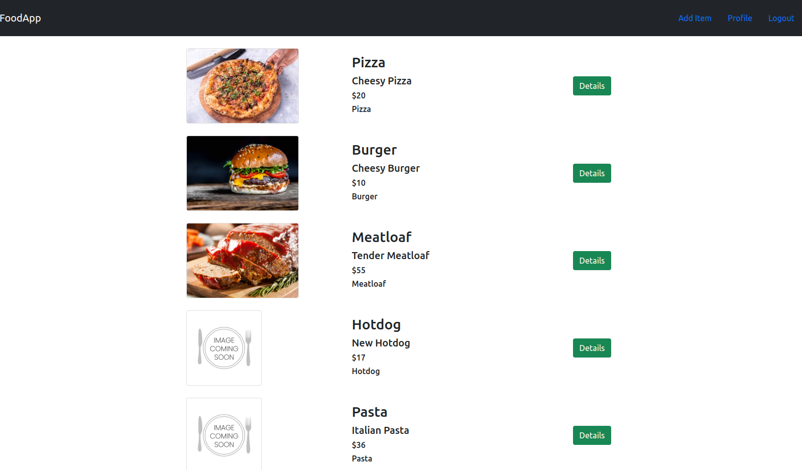
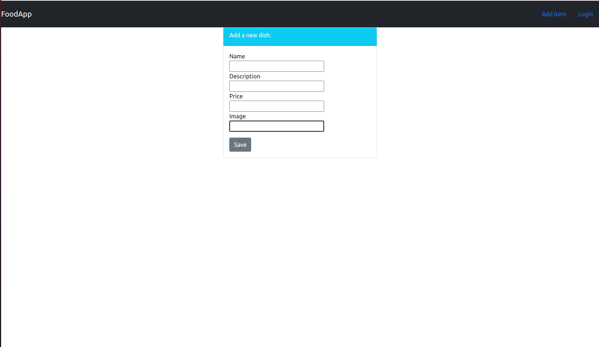
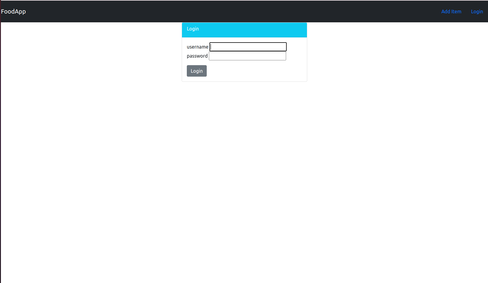

# 🍽️ Django Food Delivery Website

A web-based food delivery platform built with Django. This application allows admins to manage users and lets users log in, manage dishes, and personalize their profiles with images.

## 📸 Screenshots

### 🏠 Dashboard

### 🍛 Dish Management

### 🔐 Login Page

---

## 🚀 Features

- 🔐 User Authentication (Login/Logout)
- 👤 Admin Panel for User Management
- 🍛 Users can:
  - Add, update, and delete their dishes
  - Upload images for each dish
  - Upload and manage their profile picture

## 🛠️ Tech Stack

- **Backend:** Django (Python)
- **Database:** SQLite (default, can be swapped with PostgreSQL/MySQL)
- **Frontend:** Django Templates (can be upgraded with React/Vue)
- **Media Handling:** Django's built-in `ImageField` support
